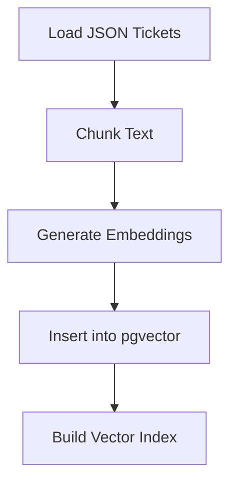
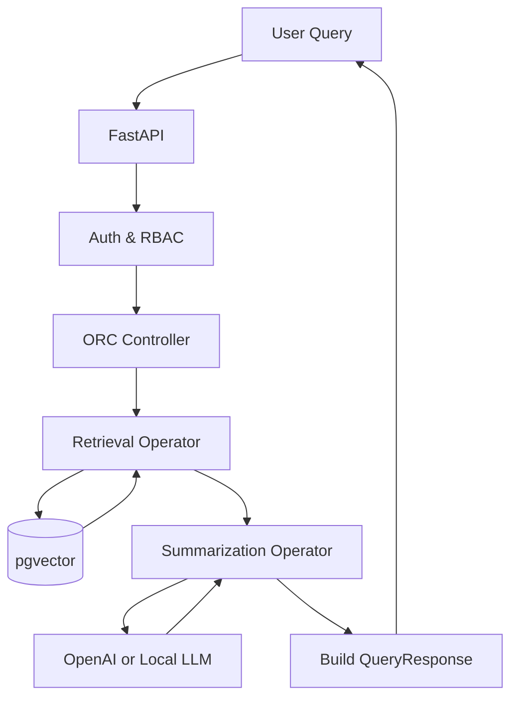
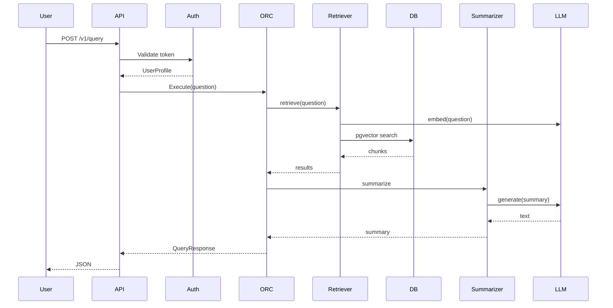
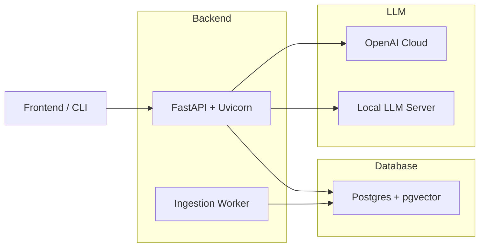

# 🚀 **Production-Ready RAG Platform**

### *FastAPI • PostgreSQL + pgvector • SentenceTransformers • OpenAI / Local LLMs • Operator-Based Pipeline (ORC)*

This repository provides a **modular, cloud-deployable Retrieval-Augmented Generation (RAG) system** designed for customer-support search, Q&A, and summarization workflows.
It includes ingestion, embeddings, vector search, summarization, observability, and operator-based orchestration.

---

# 🔧 Quickstart
## **Run in Docker**
```sh
docker compose up -d --build
```
-Docker loads the information into the database using a container that launches itself, runs a command, and then deletes the container.
## 1️⃣ **Run the API**

```sh
uvicorn app.main:app --host 0.0.0.0 --port 8080 --reload
```

## 2️⃣ **Ingest Data**

```sh
cd backend
curl -X POST http://localhost:8080/v1/ingest \
     -H "Authorization: Bearer mock-token"
```

## 3️⃣ **Query the System**

```sh
curl -X POST http://localhost:8080/v1/query \
     -H "Content-Type: application/json" \
     -H "Authorization: Bearer mock-token" \
     -d '{
        "question": "How do I reset my password?",
        "max_context_chunks": 5
     }' | jq
```

---

# 🧱 **SYSTEM ARCHITECTURE SPECIFICATION (SAS)**

## 1. Overview

This system ingests customer tickets → chunks them → embeds them → stores them in pgvector → retrieves relevant chunks → summarizes with an LLM → and returns a final answer.

**Goals**:

* Modular and testable
* Cloud-deployable
* Supports millions of documents
* Secure (auth + RBAC)
* Extensible operator-based RAG pipeline

---

# 2. High-Level Architecture

```
                        ┌──────────────────────┐
                        │      User Client     │
                        └────────────┬─────────┘
                                     │ HTTP/JSON
                                     ▼
                        ┌────────────────────────┐
                        │       FastAPI API      │
                        ├──────────┬─────────────┤
                        │ Auth     │  ORC Engine │
                        └──────────┴─────────────┘
                                     │
   ┌─────────────────────────────────┼─────────────────────────────────────┐
   │                                 │                                     │
   ▼                                 ▼                                     ▼
Retrieval Operator     Summarization Operator                  Answer Operator
         │                         │                                         │
         ▼                         ▼                                         ▼
      pgvector ←──────── Embedder ─┘                                  OpenAI LLM
```

---

# 3. Components

## 3.1 FastAPI Layer

**Responsibilities**

* Endpoint routing: `/v1/ingest`, `/v1/query`, `/v1/health`, `/v1/metrics`
* Pydantic v2 validation
* RBAC via dependency injection
* ORC pipeline execution

**Key modules**

| File                  | Responsibility              |
| --------------------- | --------------------------- |
| `routes_query.py`     | Query endpoint (RAG flow)   |
| `routes_ingestion.py` | Ingestion pipeline trigger  |
| `routes_health.py`    | Readiness + liveness checks |
| `routes_metrics.py`   | Prometheus metrics export   |
| `dependencies.py`     | DB/auth/ORC injection       |

---

## 3.2 Authentication & RBAC

Supports:

* JWT (HS256 or RS256)
* Mock auth for local dev (`MOCK_AUTH=True`)
* Permissions:

  * `query:read`
  * `ingest:write`

File:
`app/auth/token_parser.py`

---

## 3.3 ORC Pipeline (Operator-Driven RAG Controller)

The **ORC** is the orchestrator of the full RAG workflow.

### Operators

| Operator                    | Purpose                       |
| --------------------------- | ----------------------------- |
| `retrieval_operator.py`     | Retrieve top-K chunks         |
| `summarization_operator.py` | Summarize chunks using an LLM |
| `answer_operator.py`        | Optional answer formatting    |

### ORC responsibilities:

* Enforce RBAC
* Validate iteration limits
* Execute operators in sequence
* Provide safe fallback behavior

File: `app/orc/controller.py`

---

# 4. RAG Subsystem

## 4.1 Embedder

* Powered by **SentenceTransformers**
* Outputs Python lists compatible with pgvector ORM

File: `rag/embedder.py`

## 4.2 Retriever

* Embeds the question
* Performs pgvector similarity search
* Returns structured `UsedChunk` list

File: `rag/retriever.py`

## 4.3 LLM Client

* Supports **OpenAI** and optional **local LLM fallback**
* Simple `generate(prompt)` interface

File: `rag/llm_client.py`

---

# 5. Data Layer

## 5.1 Database

* PostgreSQL 15/16
* pgvector extension enabled

### Schema: `chunks`

```
id: UUID
ticket_id: str
product_tag: str
chunk_index: int
text: str
embedding: vector(384)
metadata: jsonb
created_at: timestamp
```

## 5.2 DB Session Management

File: `db/session.py`

---

# 6. Ingestion Pipeline

File: `ingestion/embed_and_index.py`

Steps:

1. Read JSON tickets
2. Extract & normalize text
3. Chunk long text
4. Embed chunks
5. Insert into Postgres
6. Optional HNSW/IVF index build

### Example ingestion JSON

```json
{
  "ticket_id": "TCK-123",
  "product_tag": "billing",
  "text": "I need help updating my credit card..."
}
```

---

# 7. Observability

Includes:

* JSON logs with color in development
* Prometheus metrics
* Optional OpenTelemetry tracing

Files:

| File                | Description               |
| ------------------- | ------------------------- |
| `logging_config.py` | Structured JSON logs      |
| `metrics.py`        | HTTP request metrics      |
| `tracing.py`        | Distributed tracing setup |

---

# 8. Data Flows

## 8.1 Ingestion Flow



## 8.2 Query (RAG) Flow



---

# 9. Sequence Diagram



---

# 10. Deployment Architecture



---

# 11. Performance Tuning

## Embedding

* `EMBEDDING_BATCH_SIZE` configurable
* GPU support via CUDA

## Retrieval

Recommended pgvector index:

```sql
CREATE INDEX ON chunks USING hnsw (embedding vector_cosine_ops);
```

## LLM

* `max_tokens=400`
* Temperature 0.2–0.3 for consistency

---

# 12. Security

## Authentication

* JWT support
* Mock auth for dev environments only

## RBAC

* Fine-grained role permissions
* Optional product_tag scoping

## Transport Security

* TLS termination recommended at ingress

---

# 13. Failure Modes

| Failure         | Cause                | Mitigation            |
| --------------- | -------------------- | --------------------- |
| LLM Timeout     | API / network issues | Local LLM fallback    |
| Empty Retrieval | Weak embeddings      | Safety message return |
| DB Corruption   | Bad writes / crash   | Auto-rebuild index    |
| JWT Invalid     | Tampered or expired  | 401 Unauthorized      |

---

# 14. Future Extensions

* Redis query caching
* Hybrid BM25 + embeddings
* Multi-tenant isolation
* Distilled compact embeddings
* Streaming answers (SSE)

